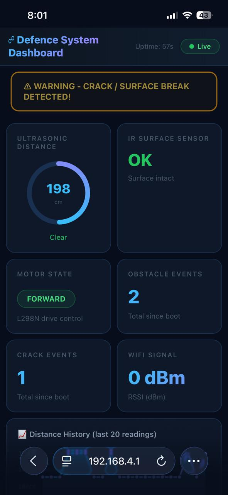
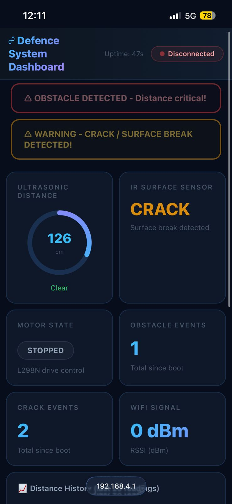

# 🚆 Railway Track Crack Detection & Monitoring Rover (STM32 + ESP32)

## Overview

This project is a railway track inspection rover built using STM32 Nucleo F446RE with an integrated ESP32-based web monitoring system.

The system detects cracks in railway tracks using an IR sensor and detects obstacles using an ultrasonic sensor. If any abnormal condition is detected, the rover stops immediately.

To improve usability, an ESP32 module is added which receives data from STM32 via UART and hosts a local web dashboard. Users can connect to the ESP32 hotspot and monitor real-time system status directly through a browser.

---

## Components Used

* STM32 Nucleo F446RE
* ESP32 (WiFi + Web Server)
* L298N Motor Driver
* DC Motors
* IR Sensor
* Ultrasonic Sensor (HC-SR04)
* HC-05 Bluetooth Module

---

## Working

* The rover moves forward continuously

* IR sensor (PA4):

  * Detects cracks in the track
  * If triggered → motors stop immediately

* Ultrasonic sensor:

  * Measures distance in front
  * If object is too close → motors stop

* STM32 handles:

  * Sensor readings
  * Motor control
  * UART communication

* ESP32 handles:

  * Receives data from STM32
  * Hosts a local web server
  * Displays system data on dashboard

* User can monitor:

  * Crack detection status
  * Obstacle distance
  * Motor state
  * Alerts

---

## Implementation Details

* TIM2 is used as a microsecond timer for ultrasonic measurement
* Distance is calculated based on echo pulse width
* Multiple readings are averaged to reduce noise
* Motor imbalance was corrected using software PWM (~50% duty cycle)

---

## 🌐 ESP32 Web Dashboard Integration

To enhance monitoring, an ESP32 module is used as a WiFi-enabled edge server.

### System Architecture

STM32 → UART → ESP32 → Web Dashboard

### Key Features

* ESP32 hosts a local web dashboard (port 8000)
* Works without internet (local network)
* Supports:

  * WiFi Station mode
  * Access Point (hotspot) mode

### Dashboard Features

* Real-time ultrasonic distance display
* IR-based crack detection status (OK / CRACK)
* Motor state display (FORWARD / STOPPED)
* Event counters:

  * Obstacle detections
  * Crack detections
* WiFi signal strength (RSSI)
* Live UART logs from STM32
* Distance history graph
* Visual alert system

### Accessing Dashboard

* Connect to ESP32 hotspot:
  SSID: RailwayMonitor-AP
  Password: railway123

* Open in browser:
  http://192.168.4.1:8000

---

## Challenges Faced

* Motor imbalance (rover drifting)
* Ultrasonic sensor noise
* IR sensor false triggering
* Power stability issues

---

## Future Improvements

* Improve crack detection accuracy
* Add servo-based scanning
* Cloud-based remote monitoring
* AI-based fault prediction
* GPS integration for tracking

---

## 📁 Project Structure

STM32-Railway-Crack-Detection-System/
├── stm32_firmware/
│     └── main.c
├── esp32_dashboard/
│     └── railway_dashboard.ino
├── images/
├── README.md

---

## 📸 Project Images

### Testing on Dummy Track (Working Prototype)

### Final Hardware Setup

### Wiring and Sensor Connections

---

## 🌐 Web Dashboard (ESP32 Hosted)

### Normal Operation (No Crack / Safe State)

### Alert Condition (Crack / Obstacle Detected)

---

## Note

This project started as a basic STM32-based rover and was later extended by integrating ESP32 for real-time monitoring and visualization. It helped in understanding embedded systems, communication between controllers, and building simple IoT-based interfaces.
