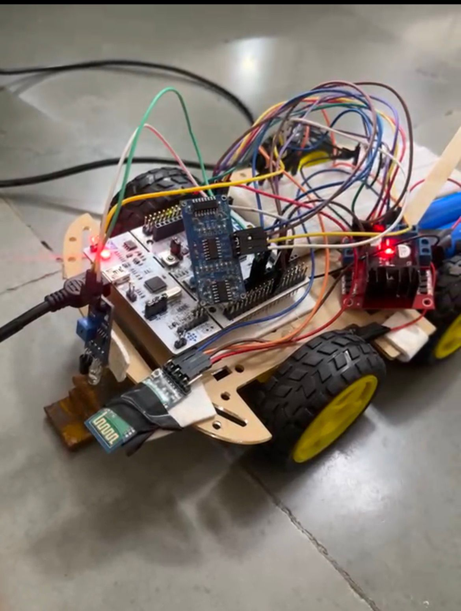
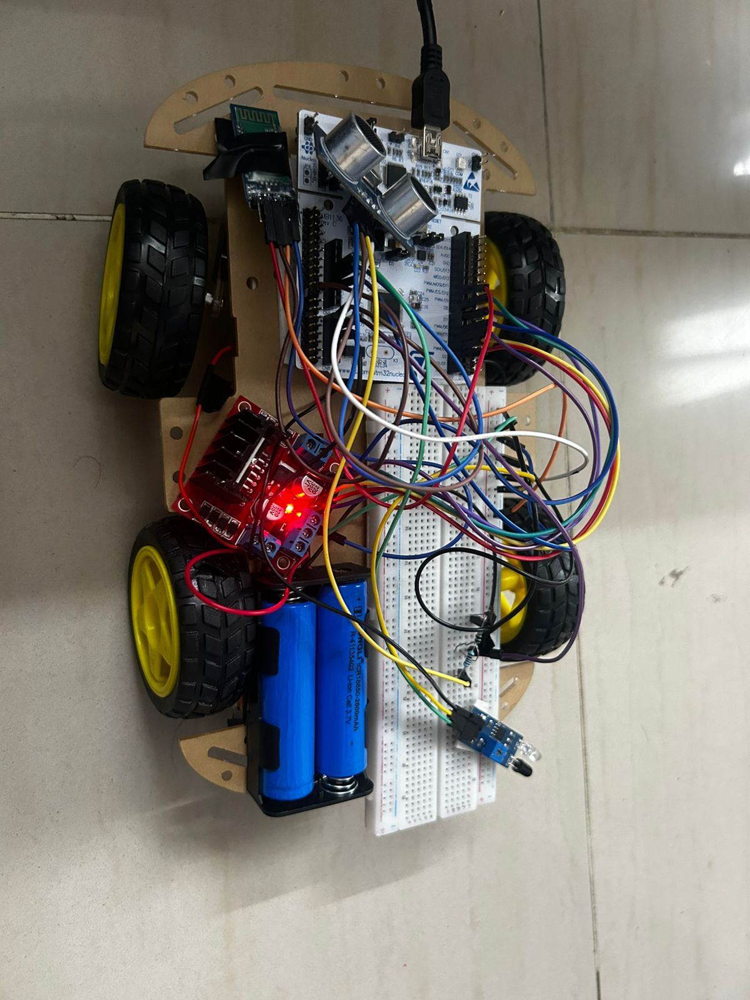
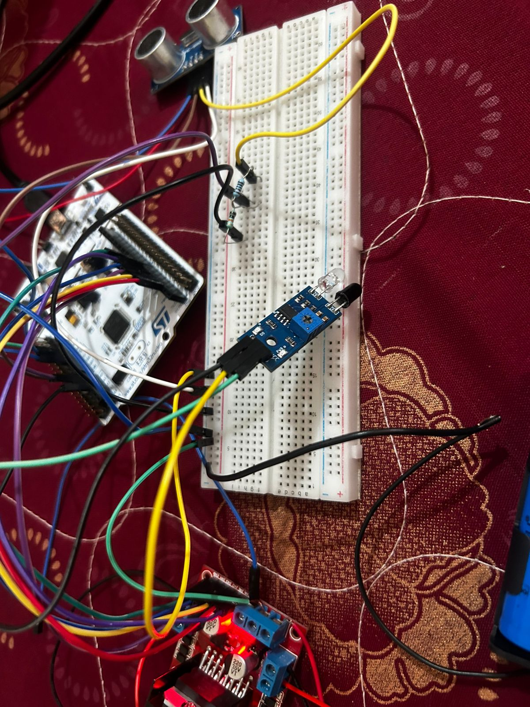

# 🚆 Railway Track Crack Detection Rover (STM32)

## Overview

This project is a simple railway track inspection rover built using STM32 Nucleo F446RE.
The idea was to detect cracks in the track and stop the rover immediately when something abnormal is detected.

An IR sensor is used for crack detection and an ultrasonic sensor is used to detect obstacles in front. The rover does not try to avoid obstacles — it just stops when something is detected.

---

## Components Used

* STM32 Nucleo F446RE
* L298N Motor Driver
* DC Motors
* IR Sensor
* Ultrasonic Sensor (HC-SR04)
* HC-05 Bluetooth Module

---

## Working

* The rover moves forward continuously

* IR sensor (connected on PA4):

  * Detects cracks in the track
  * If triggered → motors stop and warning is printed

* Ultrasonic sensor:

  * Measures distance in front
  * If an object is too close → motors stop

* Data is sent using:

  * UART (for TeraTerm)
  * Bluetooth (HC-05 module)

---

## Implementation Details

* TIM2 is used as a microsecond timer for ultrasonic measurement

* Distance is calculated based on echo pulse width

* Multiple readings are taken and averaged to reduce noise

* One motor was slightly faster than the other
  → fixed by applying software PWM on one motor (~50% duty cycle)

---

## Challenges Faced

* Motor imbalance (rover was drifting to one side)
* Unstable ultrasonic readings
* IR sensor giving false triggers sometimes

---

## Future Improvements

* Add ESP module for remote monitoring
* Add servo motor for scanning
* Improve detection logic

---

## Project Structure

Core/
├── Src/main.c
└── Inc/main.h
Drivers/
README.md

---

## Note

This was one of my early STM32 projects and helped me understand timers, GPIO, UART and working with multiple sensors together.

## 📸 Project Images

### Testing on Dummy Track (Working Prototype)

### Final Hardware Setup

### Wiring and Sensor Connections
